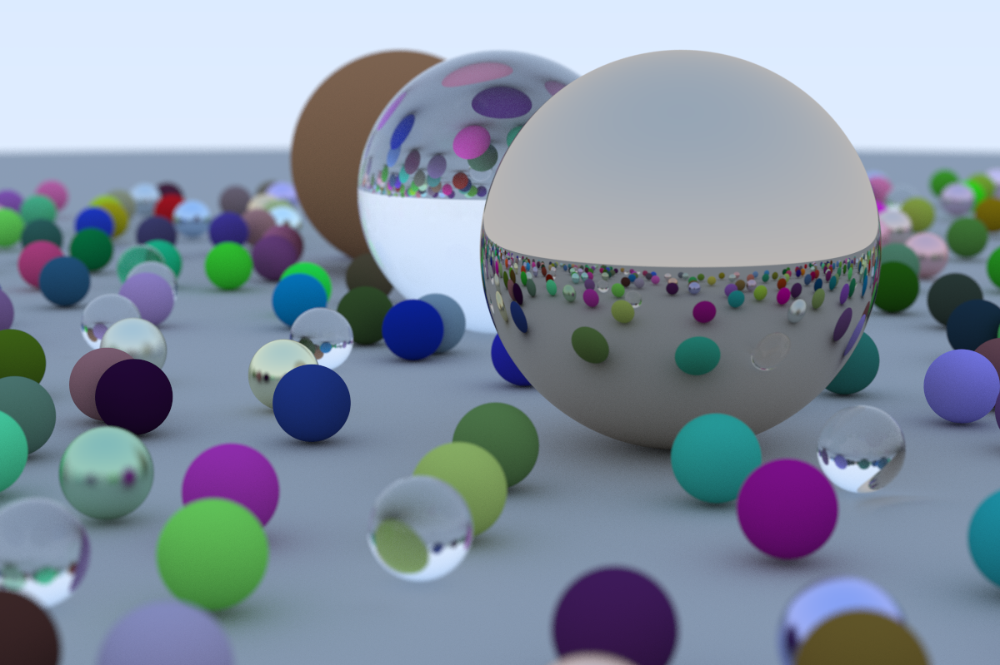

# Ray Tracer Engine



This is a ray tracer engine based on the book [_Ray Tracing in One Weekend_](https://raytracing.github.io/books/RayTracingInOneWeekend.html).

The engine is written in Rust, adapted from the C++ version of the book. Multi-threading support has also been added.

Future plans:
  - Use BVH to improve performance
  - Add support for other solids
  - Add more textures

## Build and Run

First, install the latest stable version of Rust. Next, in this folder, run:

```bash
cargo run --release
```

This will output the result as `out.png`. Simply open the image using your preferred image viewer.